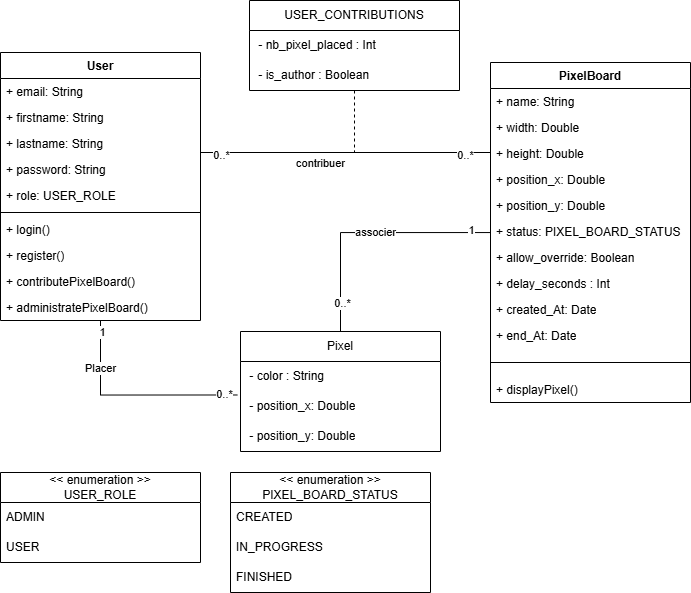
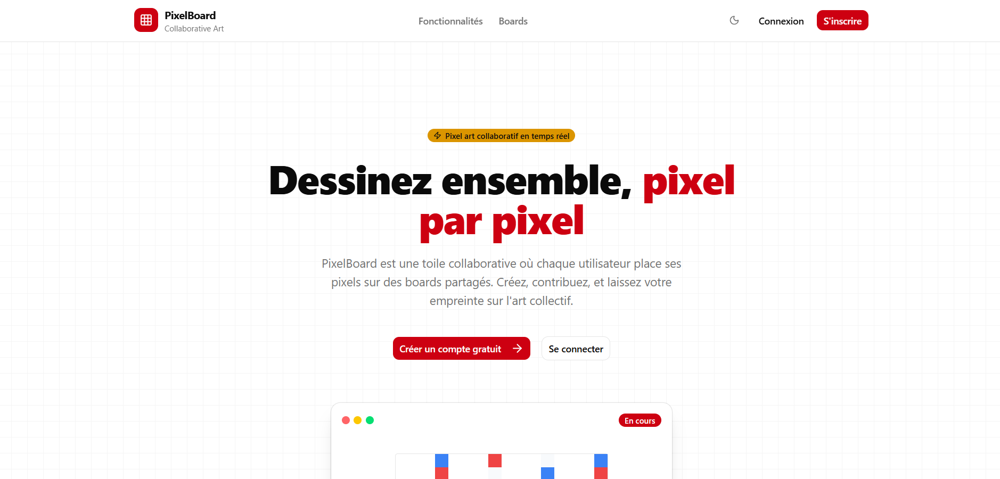
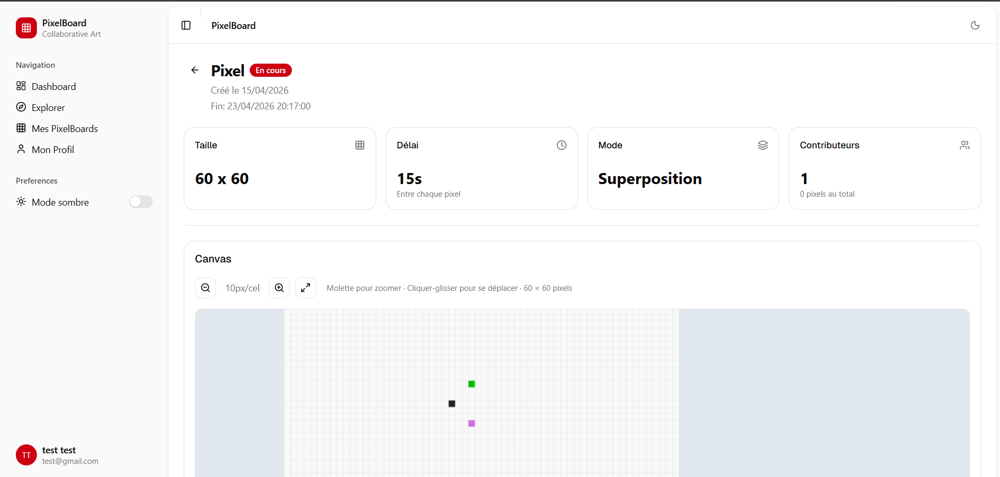

# PixelBoard

Toile collaborative de pixel art en temps réel.

## Membres du groupe

| Membre | Contributions |
| --- | --- |
| **AYIVI Marie-diégo Crédo** | Définition de l'architecture et répartition des tâches, structuration du projet (monorepo, dossiers, configuration), modèles Mongoose et schémas de validation Zod, implémentation de l'API (authentification, middleware, routes, placement de pixels, gestion des boards), développement du frontend (composant tailwind, shadcn, page d'accueil, mode visiteur non connecté, layouts, thème, intégration des services API, canvas, statistiques), configuration Docker, infrastructure Terraform et déploiement GCP, pipeline CI/CD GitHub Actions, revue de code et corrections |
| **MOUMENI Mohamed Amine** | Intégration du service d'envoi d'emails et du reset de mot de passe, export des boards en image, upload et replay d'images, interface d'administration dynamique, outils de board (UI et gestion de la date de fin) |
| **RAKOTOSON Mamitiana** | Mise en place de la communication WebSocket temps réel avec tooltip auteur, développement de la carte interactive et page d'exploration, carte globale , amelioration de l' interaction avec le canvas , pages utilisateur (dashboard, profil, contributions, détail board), intégration du contexte d'authentification, composants UI Shadcn et types TypeScript |
| **BENDIB Khadija** | Développement des pages d'authentification (login, register, reset password), module d'administration (CRUD boards, gestion des rôles, paramètres de délai), navigation admin dans le layout utilisateur, heatmap des contributions |

## Démo en ligne

http://34.79.5.40

- **ADMIN** :
  - **email**: admin@pixelboard.com
  - **password** : Admin1234!
    
## Architecture

```
packages/
├── client/       # Frontend React + Vite
│   └── src/
│       ├── main.tsx
│       └── App.tsx
└── api/          # Backend Express.js
    ├── index.ts  # Point d'entrée
    ├── api.ts    # Routeur principal (/api)
    ├── routes/   # Routes HTTP
    └── services/ # Logique métier
docker/           # Configuration Docker (dev & prod)
deployment/       # Infrastructure GCP via Terraform
.github/          # CI/CD GitHub Actions
```



## Technologies

| Couche | Stack |
| --- | --- |
| Frontend | React, Vite, Shadcn, TypeScript, TailwindCSS, React Router, Socket.io client |
| Backend | Node.js, Express, TypeScript, Socket.io, Mongoose |
| Base de données | MongoDB |
| Conteneurisation | Docker, Docker Compose |
| Infrastructure | GCP Compute Engine (VM e2-standard-4, Debian 12), GCP Artifact Registry |
| IaC | Terraform (provider Google) |
| CI/CD | GitHub Actions |

## Infrastructure & Déploiement

L'infrastructure est provisionnée sur **Google Cloud Platform** via **Terraform** (`deployment/terraform/`).

Ressources créées :
- **VM** Compute Engine `e2-standard-4` avec IP statique (`34.79.5.40`), Debian 12, Docker pré-installé
- **Artifact Registry** GCP (`europe-west1`) pour stocker les images Docker
- **Firewall** : ports 80 (client), 8000 (API) et 22 (SSH) ouverts
- **Service Account** dédié à GitHub Actions avec accès en écriture sur le registry

Pipeline CI/CD en deux workflows manuels (`workflow_dispatch`) :

1. **`build.yml`** — Build & push des images Docker (`api` et `client`) vers GCP Artifact Registry, taguées avec le SHA du commit et `latest`
2. **`deploy.yml`** — Génère le `.env.prod` depuis les secrets GitHub, copie les fichiers sur la VM via SCP, puis pull les images depuis le registry et relance les containers via `docker compose`

## Fonctionnalités

### Visiteur (non connecté)
- Consulter la page d'accueil et la carte globale des boards en temps réel
- Voir les statistiques globales (boards actifs, pixels placés, artistes)
- Placer des pixels en tant qu'utilisateur anonyme
- Créer un compte / se connecter

### Utilisateur connecté
- Placer des pixels sur les boards (avec cooldown configurable par board)
- Explorer tous les boards disponibles
- Consulter et gérer ses propres boards
- Uploader une image pour contribution automatique en pixels
- Voir le replay d'un board (historique des pixels)
- Exporter un board en PNG ou SVG
- Gérer son profil

### Administrateur
- Créer, modifier et supprimer des boards (taille, cooldown, mode override)
- Gérer les utilisateurs
- Consulter la heatmap des contributions par board
- Accès à un dashboard de statistiques avancées

## Démarrage local

```bash
npm install
npm start
```

| Service | URL                   |
| ------- | --------------------- |
| Client  | http://localhost:5173 |
| API     | http://localhost:8000 |

## Démarrage avec Docker

```bash
cd docker
docker compose up -d --build
```

## Aperçu



